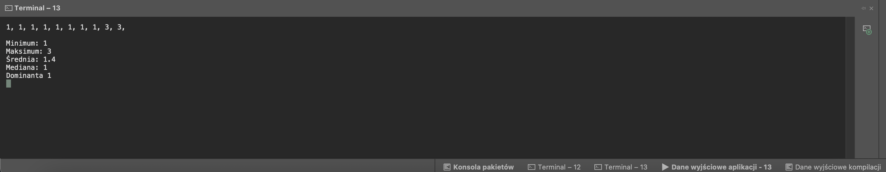

# Wypisanie konkretnych imformacji z zakresu liczb

Repozytorium zawiera plik z kodem, który służy do wypisania konkretnych imformacji z zakresu liczb.
Celem projektu jest stworzenie programu, który wygeneruje losowe liczby, a następnie obliczy i wypisze określone wartości.

## Spis treści:
* [Technologie](#technologie)
* [Opis działania](#opis-działania)
* [Przykładowe zdjęcia](#przykładowe-zdjęcia)
* [Status projektu](#status-projektu)

## Technologie
Program w całości został wykonany za pomocą języka C#.

## Opis działania 
Dzięki generatorowi program generuje określoną liczbę cyf i zapisuje je w tablicy.
Następnie poprzez określone operacje wylicza określone wartości, takie jak:
- minimalna liczba w zakresie
- maksymalna liczba w zakresie
- średnia
- mediana 
- dominanta

Ostatnim etapem jest wypisanie wszystkich informacji w terminalu razem z wygenerowanym zakresem liczb.

## Przykładowe zdjęcia
Oto kilka przykładowych zdjęć ukazujących działanie programu.

## Status projektu
 Projekt został ukończony i jest dostępny do powszechnego użycia.

